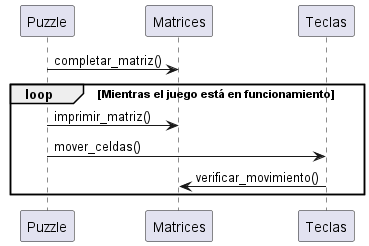

# El puzzle de davinci

- María Juliana Alzate Saavedra - 20232020082

El presente es un juego llamado el Puzzle de Davinci el cual consiste en organizar los recuadros al mover la celda en blanco para poder ubicar las imagenes en orden 

- A continuación el diagrama de casos de usos:

- A continuación el diagrama de clases:

- A continuación el diagrama de secuencia:

